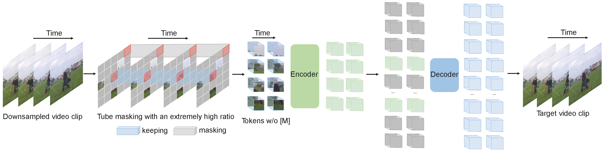

# VideoMAE for Action Detection (NeurIPS 2022 Spotlight) [[Arxiv]](https://arxiv.org/abs/2203.12602)




[](https://creativecommons.org/licenses/by-nc/4.0/)<br>
[](https://paperswithcode.com/sota/action-recognition-on-ava-v2-2?p=videomae-masked-autoencoders-are-data-1)


> [**VideoMAE: Masked Autoencoders are Data-Efficient Learners for Self-Supervised Video Pre-Training**](https://arxiv.org/abs/2203.12602)<br>
> [Zhan Tong](https://github.com/yztongzhan), [Yibing Song](https://ybsong00.github.io/), [Jue Wang](https://juewang725.github.io/), [Limin Wang](http://wanglimin.github.io/)<br>Nanjing University, Tencent AI Lab

This repo contains the supported code and scripts to reproduce action detection results of [VideoMAE](https://arxiv.org/abs/2203.12602). The code of pre-training is available in [original repo](https://github.com/MCG-NJU/VideoMAE).

## 📰 News

**[2023.1.16]**  Code and pre-trained models are available now! <br>


## 🚀 Main Results

### ✨ AVA 2.2

|  Method  |  Extra Data  | Extra Label | Backbone | #Frame x Sample Rate | mAP  |
| :------: | :----------: | :---------: | :------: | :------------------: | :--: |
| VideoMAE | Kinetics-400 |   &cross;   |  ViT-S   |         16x4         | 22.5 |
| VideoMAE | Kinetics-400 |   &check;   |  ViT-S   |         16x4         | 28.4 |
| VideoMAE | Kinetics-400 |   &cross;   |  ViT-B   |         16x4         | 26.7 |
| VideoMAE | Kinetics-400 |   &check;   |  ViT-B   |         16x4         | 31.8 |
| VideoMAE | Kinetics-400 |   &cross;   |  ViT-L   |         16x4         | 34.3 |
| VideoMAE | Kinetics-400 |   &check;   |  ViT-L   |         16x4         | 37.0 |
| VideoMAE | Kinetics-400 |   &cross;   |  ViT-H   |         16x4         | 36.5 |
| VideoMAE | Kinetics-400 |   &check;   |  ViT-H   |         16x4         | 39.5 |
| VideoMAE | Kinetics-700 |   &cross;   |  ViT-L   |         16x4         | 36.1 |
| VideoMAE | Kinetics-700 |   &check;   |  ViT-L   |         16x4         | 39.3 |

## 🔨 Installation

Please follow the instructions in [INSTALL.md](INSTALL.md).

## ➡️ Data Preparation

Please follow the instructions in [DATASET.md](DATASET.md) for data preparation.

## ⤴️ Fine-tuning with pre-trained models

The fine-tuning instruction is in [FINETUNE.md](FINETUNE.md).

## 📍Model Zoo

We provide pre-trained and fine-tuned models in [MODEL_ZOO.md](MODEL_ZOO.md).

## ☎️ Contact 

Zhan Tong: tongzhan@smail.nju.edu.cn

## 👍 Acknowledgements

Thanks to Lei Chen for support. This project is built upon [MAE-pytorch](https://github.com/pengzhiliang/MAE-pytorch), [BEiT](https://github.com/microsoft/unilm/tree/master/beit) and [AlphAction](https://github.com/MVIG-SJTU/AlphAction). Thanks to the contributors of these great codebases.

## 🔒 License

The majority of this project is released under the CC-BY-NC 4.0 license as found in the [LICENSE](https://github.com/MCG-NJU/VideoMAE-Action-Detection/blob/main/LICENSE) file. Portions of the project are available under separate license terms: [pytorch-image-models](https://github.com/rwightman/pytorch-image-models) are licensed under the Apache 2.0 license. [BEiT](https://github.com/microsoft/unilm/tree/master/beit) is licensed under the MIT license.

## ✏️ Citation

If you think this project is helpful, please feel free to leave a star⭐️ and cite our paper:

```
@inproceedings{tong2022videomae,
  title={Video{MAE}: Masked Autoencoders are Data-Efficient Learners for Self-Supervised Video Pre-Training},
  author={Zhan Tong and Yibing Song and Jue Wang and Limin Wang},
  booktitle={Advances in Neural Information Processing Systems},
  year={2022}
}

@article{videomae,
  title={VideoMAE: Masked Autoencoders are Data-Efficient Learners for Self-Supervised Video Pre-Training},
  author={Tong, Zhan and Song, Yibing and Wang, Jue and Wang, Limin},
  journal={arXiv preprint arXiv:2203.12602},
  year={2022}
}
```
